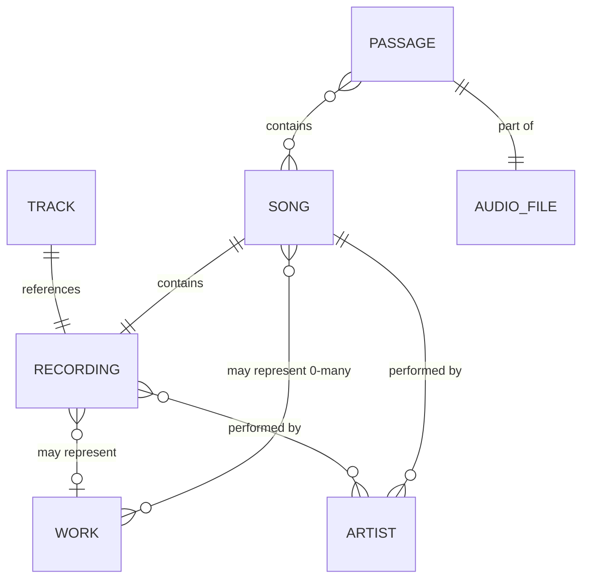

> ⚠️ **INHERITED DOCUMENT — ACTIVE DESIGN INPUT**
>
> Copied from `McRhythm/docs/REQ002-entity_definitions.md` on 2026-08-09. **Not a Vaino specification.**
>
> Passage / Song / Recording / Work entity model.
>
> Prose is unaltered. Cross-references were rewired to imported siblings where those exist, and de-linked to plain text where the target was not imported `[INH-HAZ-050]`.
>
> Identifier tags and document numbers below belong to McRhythm/WKMP's scheme, not Vaino's — see ../README.md.

---

# Entity Definitions

**📝œ TIER 1 - AUTHORITATIVE SOURCE DOCUMENT (Component)**

Defines core entity terminology used throughout WKMP documentation. Part of [requirements.md](MCR-REQ001-requirements.md). See Document Hierarchy.

**Update Policy:** ✅ Product terminology decisions | ❌ NOT derived from design/implementation

> **Related Documentation:** [Requirements](MCR-REQ001-requirements.md) | [Musical Flavor](MCR-SPEC003-musical_flavor.md) | Database Schema

## Entities

- **[ENT-MB-010]** Track: a specific recording on a particular release.  Has a MBID (MusicBrainz unique identifier), definition is [harmonized with MusicBrainz](https://musicbrainz.org/doc/Track).
- **[ENT-MB-020]** Recording: the unique distinct piece of audio underlying a track. Has a MBID, definition is [harmonized with MusicBrainz](https://musicbrainz.org/doc/Recording).
- **[ENT-MB-030]** Work: one or more recordings can exist of each work. Has a MBID, definition is [harmonized with MusicBrainz](https://musicbrainz.org/doc/Work) definition of discrete works.
- **[ENT-MB-040]** Artist: the artist(s) credited with creating a recording. Has a MBID, definition is [harmonized with MusicBrainz](https://musicbrainz.org/doc/Recording#Artist) definition of "The artist(s) that the recording is primarily credited to."
- **[ENT-MP-010]** Song: A combination of a recording, zero or more associated works, and zero or more artists, each with an assigned weight.
  - The sum of artist weights for a song must equal 1.0.
  - These weights are used in probability and cooldown calculations.
  - Each song may appear in one or more passages.
  - Work association:
    - **Common case**: One work per song (original composition)
    - **Zero works**: Improvisations, sound effects, non-musical passages
    - **Multiple works**: Mashups, medleys combining multiple source works
- **[ENT-MP-020]** Audio File: A file on disk containing audio data in formats such as MP3, FLAC, OGG, M4A, or WAV.
  - Each audio file may contain one or more passages.
  - Audio files are stored in user-designated music library directories.
- **[ENT-MP-030]** Passage: A defined span of audio, plus optional metadata
  - In WKMP a passage is a defined part of an audio file with start, fade-in, lead-in,
    lead-out, fade-out, end points in time defined, as described in Crossfade Design.
  - Multiple passages defined within an audio file may, or may not, overlap each other in time.
  - A passage may contain zero or more specific Songs.
  - At the time of Passage creation, for each Recording within the Passage, a specific Song associated with that Recording is noted.
  - Passage metadata may optionally include:
    - A title for the passage
    - References to one or more images associated with the passage
- **[ENT-MP-035]** Audio file as Passage: A passage which only identifies an audio file, with start, end, fade, lead and other metadata undefined, shall be handled as a passage which starts at the beginning of the file, ends at the end of the file, and has zero duration lead-in, lead-out, fade-in and fade-out times.

#### Zero-Song Passage

**Definition:** A passage that is not associated with any MusicBrainz Recording (and therefore has zero Songs).

**Characteristics:**
- Contains audio data that can be played normally
- No MusicBrainz metadata (Recording, Work, Artist) associated
- Has no Musical Flavor (excluded from automatic selection algorithm)
- Can only be manually queued via `POST /playback/enqueue`

**Common Examples:**
- Audio files with no MusicBrainz metadata
- Passages that fall in gaps between identified songs in an audio file
- Sound effects, spoken word, ambient sounds, or other non-musical content
- User-defined passages not yet matched to MusicBrainz database

**Terminology Note:** "Zero songs" is equivalent to "zero recordings" since each Song contains exactly one Recording ([ENT-MP-010], [ENT-CARD-040]). A passage with zero recordings inherently has zero songs.

**Playback Behavior:**
- Zero-song passages play audio identically to passages with songs
- All crossfade timing and fade curves apply normally
- Excluded from Program Director automatic selection ([ENT-CNST-010])
- No cooldown tracking (no artist/work to track)
- No Musical Flavor calculation possible

#### Ephemeral Passage

**Definition:** A temporary passage definition created transiently for ad-hoc playback without database persistence.

**Purpose:** Enable immediate playback of audio files without requiring pre-defined passage entries in the database, while maintaining consistent entity model throughout the system.

**Properties:**
- **Lifecycle:** Created on-demand during enqueue, exists only for current playback session, destroyed after passage completion
- **Identity:** Has internal passage_id (UUID) for the duration of playback
- **Storage:** Never persisted to `passages` table
- **Timing:** Uses default values (start_time=0, end_time=file_duration, zero lead/fade times)
- **Crossfade:** Uses system default fade curves and durations

**Use Cases:**
- User enqueues audio file via `POST /playback/enqueue` with only `file_path` (no `passage_guid`)
- Quick playback testing without database modification
- Temporary playback of non-library files

**Distinction from Persistent Passages:**
- Persistent passages stored in `passages` table with guid
- Ephemeral passages exist only in memory during playback
- Both types have identical structure and behavior during playback
- All crossfade logic works identically for both types

**[REQ-DEF-035]** All playable audio in WKMP must have a passage definition, either persistent (database-stored) or ephemeral (transiently-created).

## 2.0 Entity Relationship Overview

### Relationship Diagram

```
┌─────────────────────────────────────────────────────────────────┐
│                         Audio File                              │
│  - file_path (string)                                           │
│  - duration_ms (integer)                                        │
│  - segmentation_strategy (enum)                                 │
└───────────────┬─────────────────────────────────────────────────┘
                │
                │ 1:N (contains)
                │
                v
┌─────────────────────────────────────────────────────────────────┐
│                         Passage                                 │
│  - passage_id (UUID)                                            │
│  - start_ms, end_ms (integer)                                   │
│  - lead_in_ms, lead_out_ms (integer)                            │
│  - musical_flavor (JSON)                                        │
└───────────────┬─────────────────────────────────────────────────┘
                │
                │ N:M (passage-song join)
                │
                v
┌─────────────────────────────────────────────────────────────────┐
│                          Song                                   │
│  - song_id (UUID)                                               │
│  - base_probability (0.0-1.0)                                   │
└───────────────┬─────────────────────────────────────────────────┘
                │
                │ N:1 (references)
                │
                v
┌─────────────────────────────────────────────────────────────────┐
│                      Recording                                  │
│  - recording_mbid (UUID - MusicBrainz)                          │
│  - recording_title (string)                                     │
│  - duration_ms (integer - canonical)                            │
│  - acousticbrainz_data (JSON - source of musical_flavor)        │
└─────────────────────────────────────────────────────────────────┘
                │
                │ N:M (credits)
                │
                v
┌─────────────────────────────────────────────────────────────────┐
│                         Artist                                  │
│  - artist_mbid (UUID - MusicBrainz)                             │
│  - artist_name (string)                                         │
│  - artist_sort_name (string)                                    │
└─────────────────────────────────────────────────────────────────┘

                │
                │ N:M (work_credits)
                │
                v
┌─────────────────────────────────────────────────────────────────┐
│                          Work                                   │
│  - work_mbid (UUID - MusicBrainz)                               │
│  - work_title (string)                                          │
│  - work_type (string - composition, song, etc.)                 │
└─────────────────────────────────────────────────────────────────┘
```

### Cross-System Usage

| Entity | Used By | Purpose |
|--------|---------|---------|
| Passage | wkmp-ap | Playback queue, crossfading |
| Passage | wkmp-pd | Selection algorithm (flavor matching) |
| Song | wkmp-pd | Cooldown tracking (14-day song cooldown) |
| Artist | wkmp-pd | Cooldown tracking (30-minute artist cooldown) |
| Work | wkmp-pd | Cooldown tracking (2-day work cooldown) |
| Recording | wkmp-ai | Metadata source, AcousticBrainz integration |
| Recording | Musical Flavor | Distance calculation (see [SPEC003](MCR-SPEC003-musical_flavor.md)) |

### Key Relationships

**1:N (Audio File → Passages)**
- Single-file albums: 1 audio file → 10-20 passages (one per track)
- Multi-file albums: 20 audio files → 20 passages (one per file)

**N:M (Passages ↔ Songs)**
- Most passages: 1 passage → 1 song (typical case)
- Medleys: 1 passage → 2+ songs (multiple recordings in one playable segment)
- Live albums: 2+ passages → 1 song (same song performed twice)

**N:1 (Songs → Recording)**
- Multiple songs (across different passages/albums) reference same Recording MBID

**N:M (Recordings ↔ Artists)**
- Feature credits: 1 recording → 3 artists (main + 2 featured)
- Compilations: 1 artist → 200 recordings

**N:M (Recordings ↔ Works)**
- Covers: 3 recordings → 1 work (original + 2 cover versions)
- Medleys: 1 recording → 4 works (medley contains 4 compositions)

---

## Entity Relationships (Formal Specifications)

- **[ENT-REL-010]** Track references Recording
- **[ENT-REL-020]** Recording may represent Work
- **[ENT-REL-030]** Recording performed by Artist(s)
- **[ENT-REL-040]** Song contains Recording
- **[ENT-REL-045]** Song may represent zero, one, or multiple Works
- **[ENT-REL-050]** Song performed by Artist(s), no defined artist means artist unknown.
- **[ENT-REL-060]** Passage contains zero or more Song(s)
- **[ENT-REL-070]** Passage is part of Audio File, can be the entire audio file.



## Cardinality Rules

- **[ENT-CARD-010]** Track → Recording: One-to-one (each track references exactly one recording)
- **[ENT-CARD-020]** Recording → Work: Many-to-zero-or-one (a recording may or may not represent a work; multiple recordings can represent the same work)
- **[ENT-CARD-030]** Recording → Artist: Many-to-many (recordings can have multiple artists; artists perform multiple recordings)
- **[ENT-CARD-040]** Song → Recording: One-to-one (each song contains exactly one recording)
- **[ENT-CARD-045]** Song → Work: Many-to-many (a song may represent zero, one, or multiple works; multiple songs can represent the same work)
  - **Common case**: One work per song (original composition)
  - **Zero works**: Improvisations, sound effects, non-musical passages
  - **Multiple works**: Mashups, medleys combining multiple source works
- **[ENT-CARD-050]** Song → Artist: One-to-many (each song has one or more artists, each with a weight)
- **[ENT-CARD-060]** Passage → Song: Many-to-many (passages can contain multiple songs; songs appear in multiple passages)
- **[ENT-CARD-070]** Passage → Audio File: Many-to-one (multiple passages can be defined within one audio file)

## WKMP-Specific Constraints

- **[ENT-CNST-010]** Passage with zero songs: Allowed, but excluded from automatic selection (can only be manually queued)
- **[ENT-CNST-020]** Passage with multiple songs: The passage's Musical Flavor is the weighted centroid of the Flavors of the Recordings contained within its Songs. The weight for each Recording's Flavor is directly proportional to that Recording's runtime within the passage. See [Musical Flavor - Weighted Centroid Calculation](MCR-SPEC003-musical_flavor.md#more-than-one-recording-per-passage-calculation) and [Musical Taste - Weighted Taste](MCR-SPEC004-musical_taste.md#weighted-taste) for algorithm details.
- **[ENT-CNST-030]** Song identity: Defined by unique (Recording, Work, weighted Artist set) combination
  - Same recording of the same work performed by different artists (or the same artists with different weights) = different songs
  - Different recordings of same work by same artist = different songs

----
End of document - Entity Definitions

**Document Version:** 1.1
**Last Updated:** 2025-10-17

**Change Log:**
- v1.1 (2025-10-17): Added Ephemeral Passage definition
  - Added new entity definition section after [ENT-MP-035]
  - Defined temporary passage model for ad-hoc playback without database persistence
  - Added requirement traceability ID [REQ-DEF-035]
  - Supports architectural decision from wkmp-ap design review (ISSUE-4)
